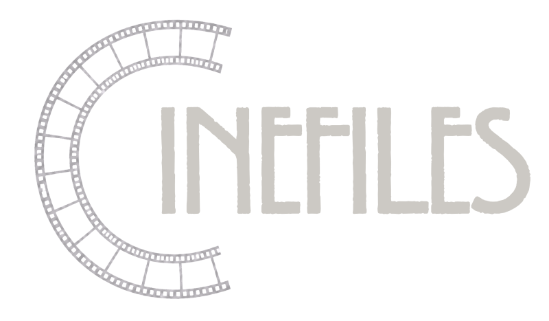

# Cinefiles

Cinefiles is an audio copyright clearance demo for independent filmmakers. It fingerprints audio with AudD, estimates Sync and Master licensing fees, generates a clearance draft, and scans plain-text scripts for audio URLs.

## Live Demo

- Frontend: https://cinefiles-frontend-u3rndiapwq-ue.a.run.app
- Backend API docs: https://cinefiles-backend-u3rndiapwq-ue.a.run.app/docs

## Audio Workflows

- Paste a public audio URL and fingerprint it through AudD.
- Upload an audio file up to 25 MB.
- Enter a known song, artist, and clip timecode for a metadata-only estimate.
- Download a valid audio clearance PDF draft from each result.
- Upload a plain-text screenplay to extract unique HTTP(S) media URLs for review.

The current demo estimates $15,000 for Sync and $15,000 for Master use on commercial tracks. URLs containing explicit markers such as `royalty-free`, `freemusic`, `public-domain`, or `creative-commons` are classified as royalty-free and receive a $0 estimate. This is a screening heuristic, not a legal determination.

## Demo Audio URLs

### Real AudD test clip

Use this with the URL tab to exercise the AudD fingerprinting workflow:

```text
https://audd.tech/example.mp3
```

### Royalty-free heuristic test

These URLs intentionally contain recognized markers. They do not need to resolve to a real file because the backend classifies the marker before calling AudD:

```text
https://demo.example.com/royalty-free/indie-track.mp3
https://demo.example.com/public-domain/piano-theme.mp3
https://demo.example.com/creative-commons/ambient.wav
```

Expected result: `Royalty-Free / Public Domain`, $0 total fees, and a downloadable audio clearance draft.

### Commercial-track path without AudD

Use the Known Track tab for a deterministic demo that does not require an external audio file:

```text
Song: Bohemian Rhapsody
Artist: Queen
Start: 00:01:30
End: 00:03:45
```

Expected result: $30,000 total estimated fees, split between Sync and Master.

## Local Test

From the repository root, create and activate the virtual environment, then install backend dependencies:

```powershell
python -m venv .venv
.\.venv\Scripts\Activate.ps1
python -m pip install -r backend\requirements.txt
```

Run the backend in one terminal:

```powershell
uvicorn backend.main:app --reload --port 8080
```

Run the static frontend in a second terminal:

```powershell
python -m http.server 5500 --directory frontend
```

Open http://127.0.0.1:5500. The local frontend calls the backend at `http://127.0.0.1:8080`.

Run the automated backend tests:

```powershell
Set-Location backend
python -m pytest test_main.py -q
```

## Cloud Run Deployment

The services are deployed separately. The backend receives `AUDD_API_TOKEN` through Cloud Run configuration, and the frontend is a static container defined by `frontend/Dockerfile`.

```powershell
gcloud run deploy cinefiles-backend --source .\backend --region us-east1 --project cinefiles-506801 --port 8080 --allow-unauthenticated
gcloud run deploy cinefiles-frontend --source .\frontend --region us-east1 --project cinefiles-506801 --port 8080 --allow-unauthenticated
```

## API Endpoints

- `POST /api/v1/clearance/audio` - AudD fingerprinting or explicit royalty-free URL classification.
- `POST /api/v1/clearance/audio/direct` - Known song and artist estimate.
- `POST /api/v1/clearance/audio/upload` - Multipart audio upload and fingerprinting.
- `POST /api/v1/scripts/scan` - Plain-text script URL extraction.

The generated OpenAPI contract is available at `/openapi.json` and can be imported into Agent Builder as an OpenAPI webhook tool.

## What's Next

### Script Render

- Add PDF and DOCX screenplay extraction.
- Let Gemini inspect uploaded scripts and return structured audio candidates with scene context, timestamps, and confidence.
- Support multiple audio candidates in one clearance report.
- Replace fixed estimates with transparent pricing based on clip duration, territory, distribution type, audience size, and rights-holder data.

## Disclaimer

Cinefiles produces preliminary estimates and draft documents for review. It does not provide legal advice or confirm that a track is legally cleared. Consult qualified entertainment counsel before distribution.

## License

MIT