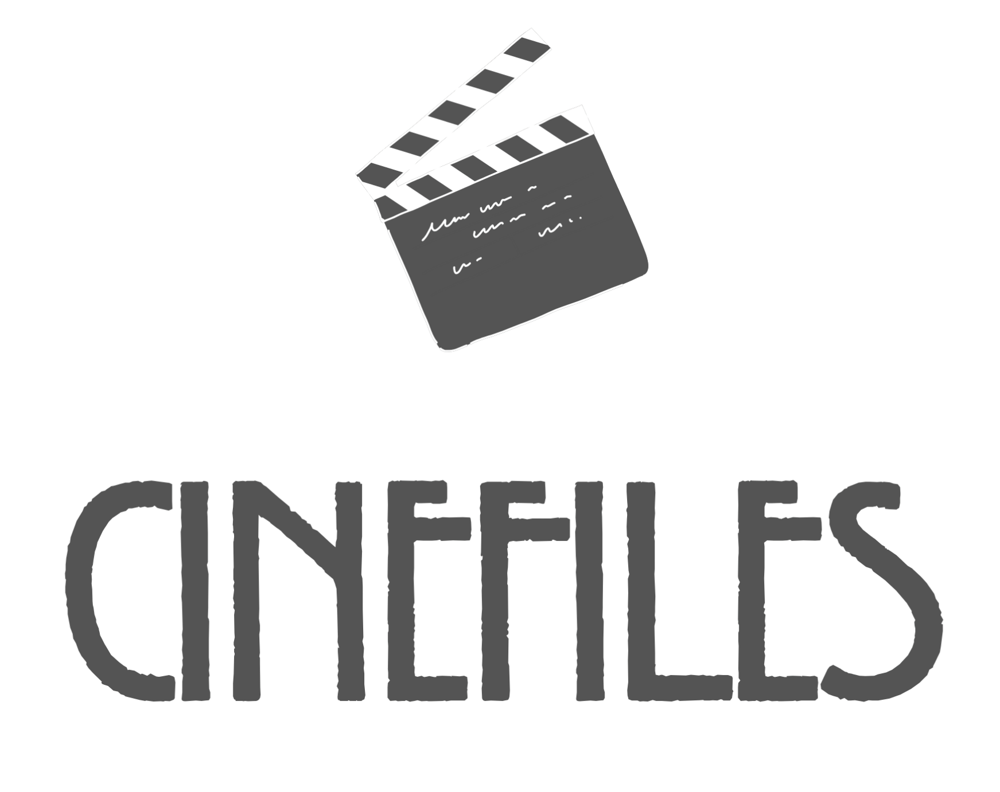

# Cinefiles
## Table of Contents


##

```txt
[Indie Filmmaker UI]
        │
        ▼
┌───────────────────────────────────┐
│         Gemini Enterprise         │ <-- Enterprise-grade Perception
│ (Gemini 3.7 Vision & Perception)  │ <-- Scans video timeline
└─────────────────┬─────────────────┘
                  │ Triggers Open Webhook Tool
                  ▼
┌───────────────────────────────────┐
│             IBM Bob               │ <-- Formulates, validates, & hosts
│   (Action Engine & MCP Protocol)  │ <-- the heavy Enterprise Legal Tasks
└───────────────────────────────────┘
```

### Application Flow

```txt
[ Filmmaker ] 
     │ Uploads video/audio clip
     ▼
[ Gemini Enterprise Agent ] 
     │ Detects audio & calls IBM Bob Webhook with clip URL/file
     ▼
[ IBM Bob Backend (Cloud Run) ]
     │ 1. Sends audio snippet to AudD API (fingerprint match)
     │ 2. Receives song title, artist, and ISRC code
     │ 3. Calculates Sync & Master Use clearance fees ($30,000)
     │ 4. Returns complete legal package JSON to Gemini
     ▼
[ Gemini Enterprise Agent ]
     │ Formats and presents the final Clearance Report to the user
```

### How To Build It

#### Step 1: Used IBM Bob to Build the "Clearance" Backend Tools

***IBM Bob excels at spinning up valid, compliant microservices and Model Context Protocol (MCP) tools without manual boilerplate coding.***

1. Open your development workspace and prompt the IBM Bob coding assistant: ***"Bob, build me a FastAPI python endpoint that accepts an asset payload (asset_name, timestamp). It needs to search an external mock copyright database, match a template legal contract, and prepare a clearance PDF form. Ensure it has a human-approval step before completion."***
2. Watch as IBM Bob automatically generates the code, writes unit tests, and structures  server logic cleanly using best practices.

#### Step 2: Initialized the Gemini Enterprise Agent

***Instead of programming loops, I wrote a Playbook—a plain-English set of structural instructions.***

1. Google Cloud Console ➔ Gemini Enterprise (Agent Builder).
2. Created a new Playbook-based Agent.
3. Defined the Agent's goal in the instructions:

#### Step 3: Connected Agent Builder to Bob via Webhooks

***To make your low-code agent trigger Bob's legal engine, you hook them together using an OpenAPI tool schema.***

1. In Vertex AI Agent Builder, click Tools ➔ Create Tool.
2. Set the tool type to OpenAPI / Webhook.
3. Paste the API schema that IBM Bob generated for your clearance endpoint.
4. In your Agent Builder Playbook instructions, add a deterministic directive:
***"Whenever a user uploads a video file, call the VerifyTrademarks tool immediately with the extracted timestamps."***

#### Step 4: Embedded Chat Widget and Deployed Frontend


#### Step 5: Securde and Audit the System

***To nail the "Technological Implementation" judging criteria, wrap deployment in standard enterprise safety layers:***

- Secrets: Ensured the API keys that Bob used to hit registries are safely drawn from the Google Cloud Secret Manager.